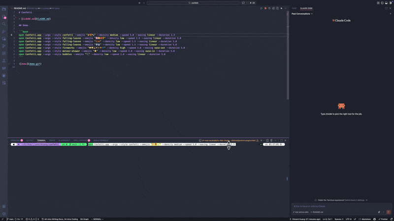
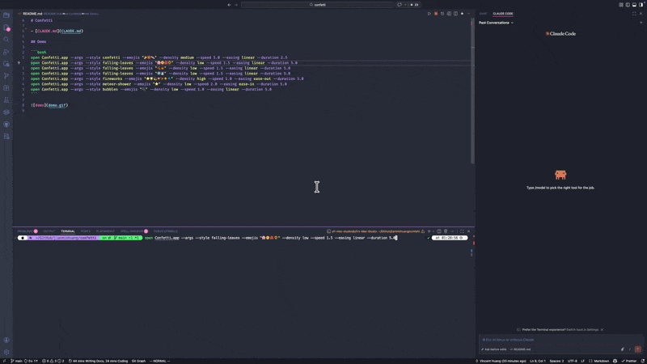
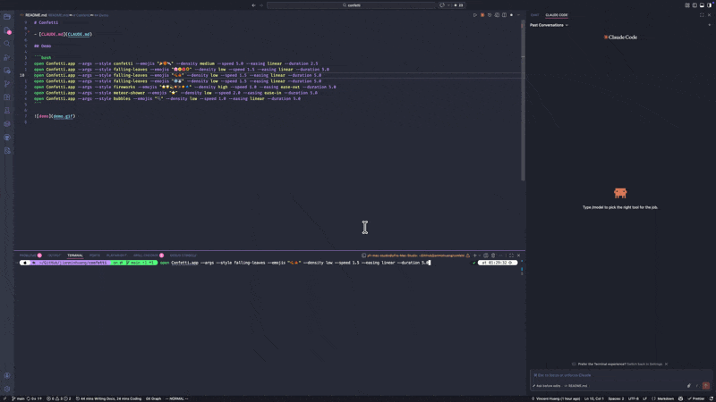

# Confetti

- [CLAUDE.md](CLAUDE.md)

## Demo

Use `--preset` to quickly launch a preconfigured effect:

```bash
open Confetti.app --args --preset confetti
```



```bash
open Confetti.app --args --preset cherry
```



```bash
open Confetti.app --args --preset maple
```



```bash
open Confetti.app --args --preset snow
```


```bash
open Confetti.app --args --preset fireworks
```


```bash
open Confetti.app --args --preset meteor
```


```bash
open Confetti.app --args --preset bubbles
```


```bash
open Confetti.app --args --preset sparkler
```


Presets can be overridden with individual parameters:

```bash
open Confetti.app --args --preset cherry --density high --speed 3.0
```

> **Note:** The `snow` and `sparkler` presets use SpriteKit's built-in `SKEmitterNode` particle system. The `--easing` parameter has no effect on them. The `--density`, `--speed`, and `--duration` parameters still work but interact differently — see [CLAUDE.md](CLAUDE.md) for details.

## Demo App

Run the Demo app to see all 8 effects in a 2-column × 4-row grid:

```bash
cd Demo && swift run
```
